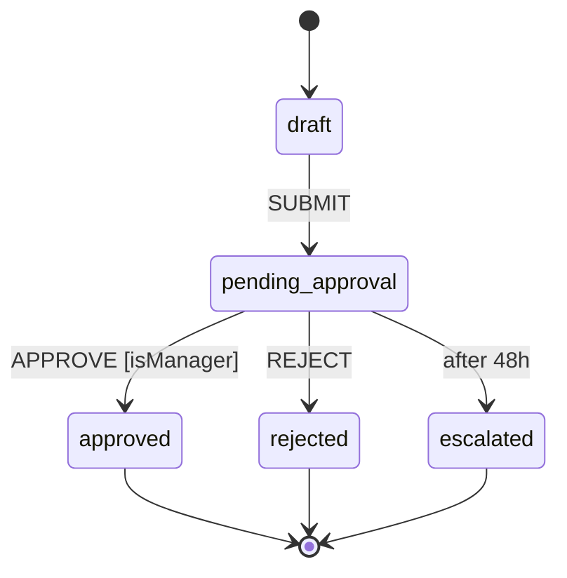

# flowyd

[](https://github.com/zihung20/flowyd/actions/workflows/ci.yml)
[](./LICENSE)
[](#)
[](https://zod.dev)
[](https://www.npmjs.com/package/flowyd)

**Strongly-typed Standard-Operating-Procedure state machines for TypeScript.**

Describe a process as states and transitions — the compiler catches typo'd state IDs, action names, and payload shapes before your code runs. Snapshots are plain JSON, so you own storage.

**[Documentation →](https://zihung20.github.io/flowyd/guide/)**  ·  **[Live Playground →](https://zihung20.github.io/flowyd/playground/)**  ·  **[Examples →](https://zihung20.github.io/flowyd/examples/)**

---

## See it

A document-approval workflow, in code and as a diagram — both generated from the same definition:



```ts
import { z } from 'zod';
import { createWorkflow, Guard } from 'flowyd';

const approval = createWorkflow({ name: 'document-approval' })
  .defineAction('SUBMIT', z.object({ submitterId: z.string() }))
  .defineAction('APPROVE', z.object({ approverId: z.string() }))
  .defineAction('REJECT', z.object({ reason: z.string() }))

  .addStep('draft')
  .addStep('pending-approval')
  .addStep('approved')
  .addStep('rejected')
  .addStep('escalated')

  .setInitial('draft')
  .setTerminal(['approved', 'rejected', 'escalated'])

  .addTransition({ from: 'draft', to: 'pending-approval', on: 'SUBMIT' })
  .addTransition({ from: 'pending-approval', to: 'approved', on: 'APPROVE', guard: Guard.inject('isManager') })
  .addTransition({ from: 'pending-approval', to: 'rejected', on: 'REJECT' })
  .addTransition({ from: 'pending-approval', to: 'escalated', after: '48h' }) // deadline
  .build();

const inst = approval.createInstance('doc-001');
inst.injectGuard('isManager', async (ctx) => ctx.payload.approverId === 'mgr-1');

await inst.dispatch('SUBMIT', { submitterId: 'alice' });
await inst.dispatch('APPROVE', { approverId: 'mgr-1' });

inst.getCurrentStates(); // ['approved']
inst.getSnapshot();      // plain JSON — persist it anywhere
```

> Type `'drft'` instead of `'draft'`, or `'APPROV'` instead of `'APPROVE'`, and it won't compile. **[Try it in the playground — no install →](https://zihung20.github.io/flowyd/playground/)**

---

## Why flowyd

- **Compile-time safety** — IDs, actions, payloads all checked
- **Zod = single source of truth** — one schema, type + runtime
- **Pure, stateless engine** — deterministic, no I/O
- **Fork/join, deadlines, waits** — no engine-owned DB or timer
- **You own persistence** — plain JSON, any store
- **Built-in visualization** — Mermaid or JSON graph

---

## Repository layout

| Package | What it is | Published |
|---|---|---|
| **[`flowyd/`](./flowyd/)** | The core library — the fluent builder, the pure engine, guards, and exporters. **[→ Library README](./flowyd/README.md)** | yes — [`flowyd`](https://www.npmjs.com/package/flowyd) |
| **[`web-runner/`](./web-runner/)** | React SPA (Vite + Tailwind + shadcn/ui + React Flow) that visualises and drives workflows in the browser. Powers the live playground. **[→ Web-runner README](./web-runner/README.md)** | no (demo / dev tool) |
| **[`docs/`](./docs/)** | Standalone VitePress documentation site (Diátaxis structure). Consumes the library via `file:../flowyd`. | no (deployed to Pages) |

---

## Quick start

```sh
pnpm add flowyd zod
```

Drop in the [`See it`](#see-it) snippet, or clone and run the guided [examples](./flowyd/examples/):

```sh
git clone https://github.com/zihung20/flowyd.git
cd flowyd/flowyd && pnpm install
npx tsx examples/01-document-approval-basics.ts
```

---

## Development

```sh
# library — build it first; web-runner and docs both consume it
cd flowyd        && pnpm install && pnpm build
cd ../web-runner && pnpm install && pnpm dev   # → http://localhost:5173
cd ../docs       && pnpm install && pnpm dev   # VitePress site
```

Full gate before any change is done:

```sh
cd flowyd && pnpm lint && pnpm check:filemap && pnpm typecheck && pnpm test && pnpm build
```

**`pnpm` only.** [Contributing guide](./docs/dev/contributing.md) · [short version](./CONTRIBUTING.md).

---

## License

[MIT](./LICENSE). Published as [`flowyd`](https://www.npmjs.com/package/flowyd), pre-1.0 — API may still evolve. [Open an issue](https://github.com/zihung20/flowyd/issues/new/choose) for bugs or ideas.
