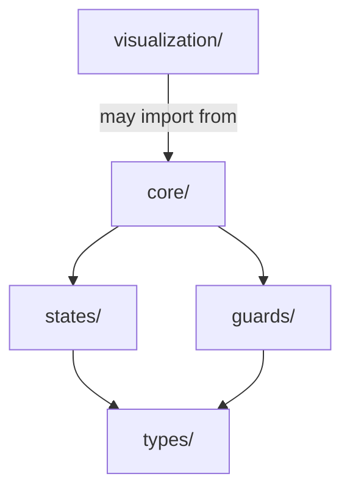

<!-- Shared layer-dependency diagram. Edit here once; architecture.md and contributing.md both include it. Kept out of routing by the srcExclude diagrams glob in .vitepress/config.ts. -->

```mermaid
flowchart TD
    visualization["visualization/"]
    core["core/"]
    states["states/"]
    guards["guards/"]
    types["types/"]

    visualization -->|may import from| core
    core --> states
    core --> guards
    states --> types
    guards --> types
```
