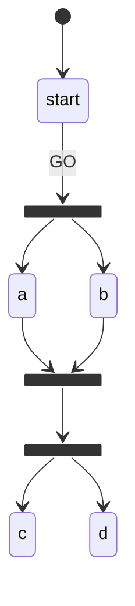

# Fixed-point engine

`ForkState` (activates multiple states immediately) and `JoinState` (activates when prerequisites complete) are both "automatic" — no extra dispatch needed. They can also chain: a fork can feed a join's prerequisites, and a join can target another fork.

The fixed-point loop resolves all of this within a single `dispatch` call.

## The algorithm

After applying the explicit transitions for a dispatched action, the engine enters a loop:

```
loop:
  for each JoinState in the workflow:
    if the join is idle AND its mode threshold is now satisfied:
      activate the join

  for each newly active ForkState:
    complete the fork
    activate all its targets

  if nothing changed in this iteration → break
```

This is a **fixed-point iteration** (Kleene iteration): it terminates when a full pass produces no new changes. Since states only move forward (`idle → active → completed`), termination is guaranteed.

## Why it matters

Consider this graph:



Without the loop, activating `join-1` would need a second dispatch to enter `fork-2`. With it, a single `GO` resolves the entire chain in one call.

## Termination proof

The state space is finite. Every state has exactly four statuses: `idle`, `active`, `waiting`, `completed`. Transitions are monotonic — a state can only move to a later status, never backwards. Therefore the number of possible state-space configurations is bounded, and each iteration of the fixed-point loop strictly decreases the number of `idle` states or terminates unchanged. The loop must terminate in at most `|states|` iterations.

## Fork atomicity

A `ForkState` is entered and completed in the same loop iteration — never left `active` between iterations. `getCurrentStates()` will never return a `ForkState` ID; forks are routing nodes, not positions.

## JoinState activation condition

A `JoinState` activates when:

- Its current status is `idle`
- The number of `completed` states in `requires` satisfies the `mode` threshold:
  - `'all'` → all states in `requires` are `completed`
  - `'any'` → at least one state in `requires` is `completed`
  - `number N` → at least N states in `requires` are `completed`

The check runs after every transition application, including ones triggered by fork resolution — so joins outside the original dispatch's scope can still activate as a side effect.
