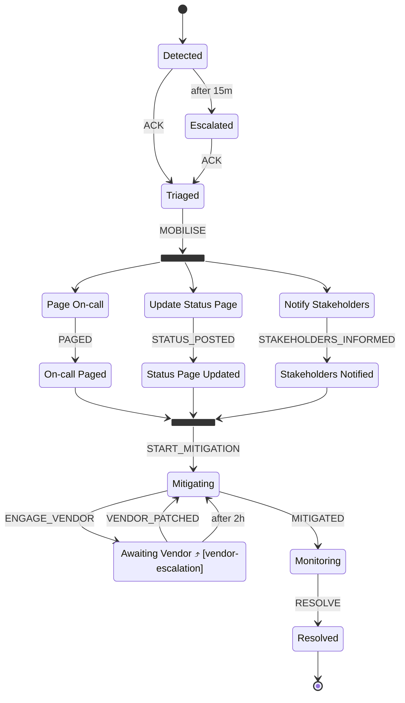

<!-- Generated by scripts/gen-example-diagrams.ts — do not edit. Regenerate with `pnpm docs:diagrams`. -->

```mermaid
stateDiagram-v2
  detected : Detected
  escalated : Escalated
  triaged : Triaged
  oncall_paged : On-call Paged
  statuspage_updated : Status Page Updated
  stakeholders_notified : Stakeholders Notified
  page_oncall : Page On-call
  update_statuspage : Update Status Page
  notify_stakeholders : Notify Stakeholders
  state respond <<fork>>
  state response_ready <<join>>
  mitigating : Mitigating
  state "Awaiting Vendor ⤴ [vendor-escalation]" as awaiting_vendor
  monitoring : Monitoring
  resolved : Resolved

  [*] --> detected
  detected --> triaged : ACK
  detected --> escalated : after 15m
  escalated --> triaged : ACK
  triaged --> respond : MOBILISE
  page_oncall --> oncall_paged : PAGED
  update_statuspage --> statuspage_updated : STATUS_POSTED
  notify_stakeholders --> stakeholders_notified : STAKEHOLDERS_INFORMED
  response_ready --> mitigating : START_MITIGATION
  mitigating --> awaiting_vendor : ENGAGE_VENDOR
  awaiting_vendor --> mitigating : VENDOR_PATCHED
  awaiting_vendor --> mitigating : after 2h
  mitigating --> monitoring : MITIGATED
  monitoring --> resolved : RESOLVE
  respond --> page_oncall
  respond --> update_statuspage
  respond --> notify_stakeholders
  oncall_paged --> response_ready
  statuspage_updated --> response_ready
  stakeholders_notified --> response_ready
  resolved --> [*]
```
