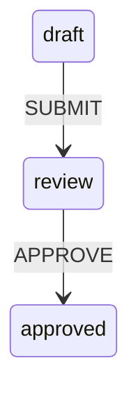
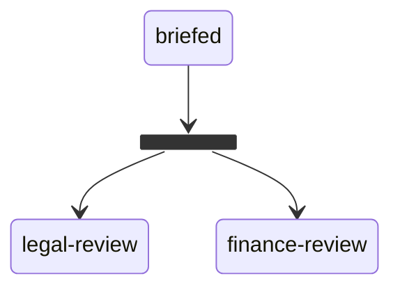
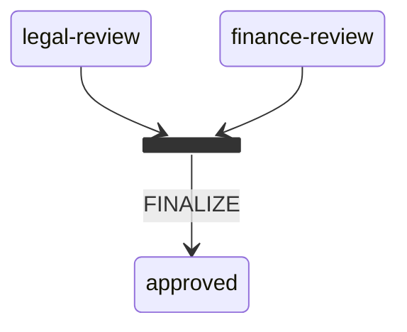
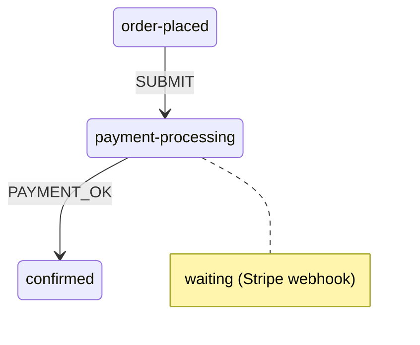

# Core Concepts

## The idea in one minute

Think of a workflow as a **checklist that knows the rules** — which step comes next, who's allowed to advance it, and what has to be true first. flowyd turns that checklist into code you can't typo your way out of.

In flowyd's words:

- a **state** is a step (`draft`, `pending-approval`, `approved`);
- a **transition** is an allowed move between two steps (`draft → pending-approval`);
- you make a move by dispatching an **action** (`SUBMIT`), optionally gated by a **guard** (a rule like "must be a manager");
- the **engine** checks the rules and advances the graph;
- the result is a **snapshot** — a plain JSON object you store wherever you like and reload later to pick up exactly where you left off.

That's the whole model. The rest of this page is the detail behind each word.

---

## States

Every node in the graph is a state. There are four kinds.

### StepState — the basic building block

`active` when entered; waits for a dispatch to advance it. Most workflow steps are `StepState`.



```ts
.addStep('draft')
.addStep('review')
.addStep('approved')
```

**Use when:** the workflow is paused at this node waiting for a human or system action.

### ForkState — fan out to parallel branches

A routing node. On entry it immediately activates all `targets` and marks itself `completed` — never left `active`, transient by design.



```ts
.addFork('fork', { targets: ['legal-review', 'finance-review'] })
```

**Use when:** multiple steps must run concurrently and independently.

### JoinState — synchronise parallel branches

Activates automatically when its `requires` threshold is satisfied — no extra dispatch needed.



```ts
.addJoin('join', {
  requires: ['legal-review', 'finance-review'],
  mode: 'all',   // 'any' | 'all' | number
})
```

| Mode       | Activates when                                  |
| ---------- | ----------------------------------------------- |
| `'all'`    | Every state in `requires` is `completed`        |
| `'any'`    | At least one state in `requires` is `completed` |
| `number N` | At least N states in `requires` are `completed` |

**Use when:** you need to re-synchronise after a `ForkState`.

### WaitState — pause for an external signal

Enters `waiting` (not `active`) when reached, pausing the workflow. Your service layer drives the external process, then calls `inst.resolveWait(stateId)` to unblock it.



```ts
.addWait('payment-processing', { externalName: 'stripe-payment' })
```

**Use when:** the workflow must wait for an external system — a webhook, a background job, a human approval in another system — before it can continue.

## Transitions

A transition is a directed edge from one state to another. It is triggered by **exactly one** of two things:

- **An action** (`on`) — fires when that action is dispatched.
- **A deadline** (`after`) — fires automatically after the source state has been active for a given duration.

```ts
.addTransition({ from: 'draft', to: 'review', on: 'SUBMIT' })
.addTransition({ from: 'review', to: 'approved', on: 'APPROVE', guard: Guard.inject('isManager') })
.addTransition({ from: 'review', to: 'rejected', on: 'REJECT' })
```

Every transition has:

- `from` — the source state (must be `active` for the transition to fire)
- `to` — the destination state
- `on` _or_ `after` — the trigger (an action name, or a delay) — exactly one
- `guard` _(optional)_ — a predicate that must return `true` for the transition to fire

### Deadlines — time-triggered transitions

Use `after` instead of `on` for *"if still here after N, go there"* — escalations, auto-cancels, SLA breaches. The clock starts when `from` is entered.

```ts
.addTransition({ from: 'pending-approval', to: 'approved',  on: 'APPROVE' })
.addTransition({ from: 'pending-approval', to: 'escalated', after: '48h' })
```

`after` accepts a duration string (`'90s'`, `'15m'`, `'48h'`, `'7d'`, …) or raw milliseconds. A deadline never fires on its own — **the host owns the clock**. It advances at the start of every `dispatch`, and a scheduler can fire deadlines on idle instances with `inst.tick(now)`, finding due instances via `inst.getNextDueAt()`. See [Add deadlines and escalation](../scenarios/timeouts).

## Lifecycle hooks

Every state can declare `onEnter` / `onExit` callbacks — side effects tied to entering or leaving it (notify, log, kick off an external job). They fire **after** the snapshot commits, so they see the new state.

```ts
.addStep('pending-approval', {
  onEnter: async (ctx) => { await notifyManagers(ctx.instanceState.instanceId); },
  onExit:  (ctx) => { metrics.stopTimer('approval'); },
})
```

`onExit` hooks run before `onEnter`, sequentially and `await`ed, for every state entered/exited that step (including fork/join and deadline firings). A throwing hook propagates out of `dispatch`/`tick`. Hooks are definition code — they are not stored in snapshots and need no re-injection after restore. See [Run side effects on enter/exit](../scenarios/hooks).

## Actions

An action is a named event with a typed payload. You define actions with `defineAction` before wiring any transitions.

```ts
.defineAction('SUBMIT', z.object({ submitterId: z.string() }))
.defineAction('APPROVE', z.object({ approverId: z.string(), reason: z.string() }))
```

Zod schema → TypeScript type automatically. You never write the type separately.

## Guards

A guard is an async predicate on a transition. If it returns `false`, the transition does not fire and the instance state is unchanged.

```ts
// Inline guard — pure function, no external deps
.addTransition({
  from: 'review',
  to: 'approved',
  on: 'APPROVE',
  guard: (ctx) => ctx.payload.approverId !== '',
})

// Named guard — implementation injected at runtime
.addTransition({
  from: 'review',
  to: 'approved',
  on: 'APPROVE',
  guard: Guard.inject('isManager'),
})
```

Named guards keep the workflow definition free of I/O. You supply the implementation when you create the instance:

```ts
inst.injectGuard('isManager', async (ctx) => {
  return myAuthService.hasRole(ctx.payload.approverId, 'manager');
});
```

Guards are **not persisted** in snapshots — re-inject them after every `restoreInstance`.

## Snapshots

A snapshot is a plain JSON object that captures the complete state of a running workflow instance.

```ts
interface InstanceSnapshot<TContext = unknown> {
  instanceId: string;
  workflowName: string;
  version: number; // increments on every successful dispatch, fired deadline, or resolveWait
  stateStatuses: Record<string, 'idle' | 'active' | 'waiting' | 'completed'>;
  isTerminal: boolean;
  history: HistoryEntry[]; // append-only audit log
  context?: TContext; // caller-owned context set via setContext(); undefined when unset
  createdAt: string; // ISO 8601
  updatedAt: string;
}
```

The snapshot is the **entire state** — there is no hidden in-memory state. Save it after every successful dispatch; restore it with `restoreInstance` to resume exactly where you left off.

```ts
// Save
const snap = inst.getSnapshot();
await db.save(snap);

// Restore
const snap = await db.load(instanceId);
const inst = workflow.restoreInstance(snap);
inst.injectGuard('isManager', myGuardFn); // re-inject guards
```

## State statuses

Every state moves through a fixed progression:

| Status      | Meaning                                                 |
| ----------- | ------------------------------------------------------- |
| `idle`      | Not yet entered                                         |
| `active`    | Currently active — awaiting a dispatch                  |
| `waiting`   | `WaitState` only — paused until `resolveWait` is called |
| `completed` | Exited; will not become active again                    |

States only move forward. The engine never reverses a status.
