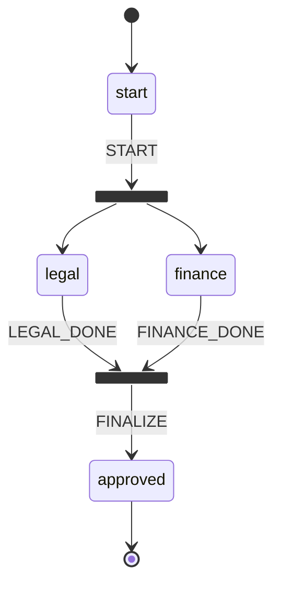
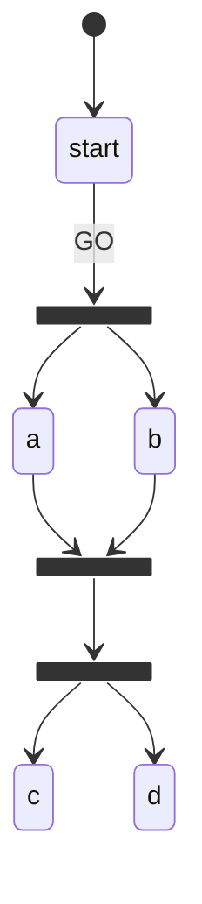

# Run steps in parallel

Use `ForkState` to split a workflow into concurrent branches, and `JoinState` to synchronise them back before advancing.

## The pattern



The fork fires the moment `START` is dispatched — no extra action is needed. Both `legal` and `finance` become `active` in the same engine tick. The join activates automatically once both have `completed`.

## Code

```ts
import { z } from 'zod';
import { createWorkflow } from 'flowyd';

const procurement = createWorkflow({ name: 'procurement' })
  .defineAction('START', z.object({}))
  .defineAction('LEGAL_DONE', z.object({ reviewedBy: z.string() }))
  .defineAction('FINANCE_DONE', z.object({ reviewedBy: z.string() }))
  .defineAction('FINALIZE', z.object({}))

  .addStep('start')
  .addStep('legal', { label: 'Legal Review' })
  .addStep('finance', { label: 'Finance Review' })
  .addFork('fork', { targets: ['legal', 'finance'] })
  .addJoin('join', { requires: ['legal', 'finance'], mode: 'all' })
  .addStep('approved')

  .setInitial('start')
  .setTerminal(['approved'])

  .addTransition({ from: 'start', to: 'fork', on: 'START' })
  .addTransition({ from: 'legal', to: 'join', on: 'LEGAL_DONE' })
  .addTransition({ from: 'finance', to: 'join', on: 'FINANCE_DONE' })
  .addTransition({ from: 'join', to: 'approved', on: 'FINALIZE' })

  .build();
```

## Execution trace

```ts
const inst = procurement.createInstance('prc-001');

await inst.dispatch('START', {});
console.log(inst.getCurrentStates()); // ['legal', 'finance']
// fork is NOT in getCurrentStates — it completed immediately

await inst.dispatch('LEGAL_DONE', { reviewedBy: 'alice' });
console.log(inst.getCurrentStates()); // ['finance']

await inst.dispatch('FINANCE_DONE', { reviewedBy: 'bob' });
console.log(inst.getCurrentStates()); // ['join']
// JoinState activated automatically in the same engine tick

await inst.dispatch('FINALIZE', {});
console.log(inst.getCurrentStates()); // ['approved']
console.log(inst.isTerminal()); // true
```

## JoinState modes

| Mode       | Activates when                                |
| ---------- | --------------------------------------------- |
| `'all'`    | Every state in `requires` is completed        |
| `'any'`    | At least one state in `requires` is completed |
| `number N` | At least N states in `requires` are completed |

```ts
// Quorum: 2 of 3 reviewers sufficient
.addJoin('join', { requires: ['reviewer-a', 'reviewer-b', 'reviewer-c'], mode: 2 })
```

## ForkState is transient

`ForkState` is completed in the same engine tick it is entered. It will never appear in `getCurrentStates()`. Forks are routing nodes — they have no waiting period.

## Chaining forks and joins

Forks and joins can chain. A join can target another fork, which activates in the same fixed-point loop iteration:



A single `GO` dispatch resolves the entire chain: the moment the last branch (`a`/`b`) completes, `join1` activates **and** `fork2` fires in that same engine tick — no extra dispatch between them. See [Fixed-Point Engine](../dev/engine) for the mechanism.
