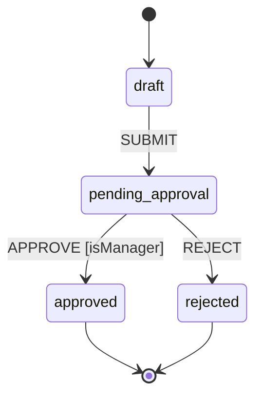

# flowyd

[](https://github.com/zihung20/flowyd/actions/workflows/ci.yml)
[](https://github.com/zihung20/flowyd/blob/main/LICENSE)
[](#)
[](https://zod.dev)
[](https://www.npmjs.com/package/flowyd)

Strongly-typed SOP state machines for TypeScript. The compiler catches every typo'd state ID, action name, and payload shape — before your code runs.

**[Full documentation →](https://zihung20.github.io/flowyd/guide/)**
**[Playground →](https://zihung20.github.io/flowyd/playground/)**

A workflow definition is also a diagram — this is the [quick example](#quick-example) below, exported with the built-in `MermaidExporter`:



---

## Compile-time safety

Typos and shape mismatches are compile errors, not runtime surprises:

```ts
const wf = createWorkflow({ name: 'approval' })
  .addStep('draft')
  .addStep('review')
  .setInitial('drft');
// TS2345: '"drft"' is not assignable to '"draft" | "review" | ...'

await inst.dispatch('APPROV', { approverId: 'x' });
// TS2345: '"APPROV"' is not assignable to '"SUBMIT" | "APPROVE" | "REJECT"'

await inst.dispatch('APPROVE', { approver: 'mgr-1' });
// TS2345: 'approver' does not exist in type '{ approverId: string }'

.addFork('fork', { targets: ['legal', 'finance'] })       // autocompletes to registered state IDs
.addJoin('join', { requires: ['legal', 'finannce'], mode: 'all' })
//                                      ^^^^^^^^^ compile error
```

---

## Install

```sh
pnpm add flowyd zod
```

`zod` is a required peer dependency.

---

## Quick example

```ts
import { z } from 'zod';
import { createWorkflow, Guard } from 'flowyd';

const purchaseOrder = createWorkflow({ name: 'purchase-order' })
  .defineAction('SUBMIT', z.object({ submitterId: z.string() }))
  .defineAction('APPROVE', z.object({ approverId: z.string(), reason: z.string() }))
  .defineAction('REJECT', z.object({ reason: z.string() }))

  .addStep('draft')
  .addStep('pending-approval')
  .addStep('approved')
  .addStep('rejected')

  .setInitial('draft')
  .setTerminal(['approved', 'rejected'])

  .addTransition({ from: 'draft', to: 'pending-approval', on: 'SUBMIT' })
  .addTransition({
    from: 'pending-approval',
    to: 'approved',
    on: 'APPROVE',
    guard: Guard.inject('isManager'),
  })
  .addTransition({ from: 'pending-approval', to: 'rejected', on: 'REJECT' })

  .build();

const inst = purchaseOrder.createInstance('po-001');

inst.injectGuard('isManager', async (ctx) => {
  return ctx.payload.approverId === 'mgr-1'; // replace with your auth check
});

await inst.dispatch('SUBMIT', { submitterId: 'alice' });
await inst.dispatch('APPROVE', { approverId: 'mgr-1', reason: 'LGTM' });

console.log(inst.getCurrentStates()); // ['approved']
console.log(inst.isTerminal()); // true

const snapshot = inst.getSnapshot(); // plain JSON — save wherever you want
```

---

## Deadlines (timeouts)

A **time-triggered transition** fires on a deadline instead of an action — `after` in place of `on`:

```ts
.addTransition({ from: 'pending-approval', to: 'escalated', after: '48h' }) // ← the deadline
```

The clock is anchored to `from` — it starts when that state is entered. `after` takes a duration string (`'500ms'`, `'90s'`, `'15m'`, `'48h'`, `'7d'`, `'2w'`) or a raw ms number. The library never reads a clock — the host does:

```ts
const inst = po.createInstance('po-1');
await inst.dispatch('SUBMIT', { submitterId: 'alice' });

inst.getNextDueAt(); // → '2026-06-08T10:00:00Z' — index this to drive a sweep

// 48h later, your scheduler loads the instance and advances the clock:
const fired = await inst.tick(new Date()); // pure; fires elapsed deadlines, returns how many
inst.getCurrentStates(); // → ['escalated']
```

- `dispatch` auto-advances elapsed deadlines first, so a stale action against an overdue state is correctly blocked.
- `getNextDueAt()` is the one value to persist and index — `SELECT … WHERE next_due_at <= now()` → `restoreInstance` → `tick(now)` → save.
- `tick` catches up after downtime in due-time order, each fire stamped with its logical due time — cascades stay reproducible. History records it as `{ kind: 'timeout', from, to }`, a discriminated union with `'action'` / `'resolve-wait'` — no magic strings.
- Every clock read is an optional injected `now` (`dispatch`, `tick`, `createInstance`) — deterministic replay, zero clock mocking.

---

## Features

- **Compile-time state IDs** — `TStates` accumulates per `addStep`/`addFork`/`addJoin`/`addWait` call
- **Typed actions & payloads** — `dispatch`/`canExecute` typed end-to-end from `defineAction`, Zod-validated at runtime
- **Fork/join** — `all` / `any` / quorum joins; dead-end non-terminal branches auto-complete on `build()`
- **External wait states** — `WaitState` pauses until `resolveWait`
- **Deadlines** — `after: '48h'` transitions; host owns the clock via `tick`/`getNextDueAt`
- **Purely functional persistence** — `getSnapshot()` / `restoreInstance()`, no storage opinions
- **Typed instance context** — `setContext(schema)` makes context required at `createInstance`; `getContext()` returns `TContext | undefined`, no cast
- **Fully generic type chain** — context, state IDs, and action types flow end-to-end from builder to instance, zero internal casts
- **Rewind** — `instance.rewind(version)` returns an independent deep-cloned snapshot for any past version
- **Typed queries** — `getCurrentStates(): TStates[]`, `getAvailableTransitions(): (keyof TActions & string)[]`
- **Composable guards** — `Guard.inject`, `Guard.fn`, `Guard.and`, `Guard.or`, `Guard.not`
- **Built-in visualization** — Mermaid `stateDiagram-v2` and JSON graph for React Flow / D3, including fork/join edges

---

## Runnable examples

The [`examples/`](https://github.com/zihung20/flowyd/tree/main/flowyd/examples) directory is a guided ladder — seven self-contained
scripts from the smallest possible workflow up to full, real-world ones, exercising every feature above:

```sh
npx tsx examples/01-document-approval-basics.ts
```

| #   | File                             | What it teaches                                                                      |
| --- | -------------------------------- | ------------------------------------------------------------------------------------ |
| 01  | `01-document-approval-basics.ts` | The essentials: actions, steps, the graph, dispatching, blocked results              |
| 02  | `02-guards-and-context.ts`       | Typed context and every flavour of guard; routing by guard, `canExecute`             |
| 03  | `03-parallel-fork-join.ts`       | Fork/join, join modes (`all`/`any`/quorum), the two-state auto-complete pattern      |
| 04  | `04-deadlines-hooks-wait.ts`     | Deadlines (`tick`/`getNextDueAt`), `onEnter`/`onExit` hooks, wait states             |
| 05  | `05-loan-origination.ts`         | Everything together, service-style: snapshot/restore, `rewind`, both exporters       |
| 06  | `06-incident-response.ts`        | Role guards, SLAs (incl. a deadline from a _waiting_ state), persistence, dashboards |
| 07  | `07-dynamic-workflow.ts`         | `createDynamicWorkflow`: compiling workflows from runtime config                     |

See [`examples/README.md`](https://github.com/zihung20/flowyd/blob/main/flowyd/examples/README.md) for a full feature-coverage map.

---

## Documentation

| Section                                                                | What's there                                  |
| ---------------------------------------------------------------------- | --------------------------------------------- |
| [Introduction & type safety](https://zihung20.github.io/flowyd/guide/) | What it is, compile-time guarantees in detail |
| [Core Concepts](https://zihung20.github.io/flowyd/guide/concepts)      | States, transitions, guards, snapshots        |
| [Examples](https://zihung20.github.io/flowyd/examples/)                | Seven runnable examples, basics → full        |
| [Scenarios](https://zihung20.github.io/flowyd/scenarios/)              | Task-based guides ("I want to…")              |
| [API Reference](https://zihung20.github.io/flowyd/api/)                | Complete method reference                     |
| [Developer Guide](https://zihung20.github.io/flowyd/dev/)              | Architecture, contributing, design decisions  |

---

## Requirements

- Node.js ≥ 20
- TypeScript ≥ 5.0 with `strict: true`
- `zod` ≥ 3

---

## License

MIT
